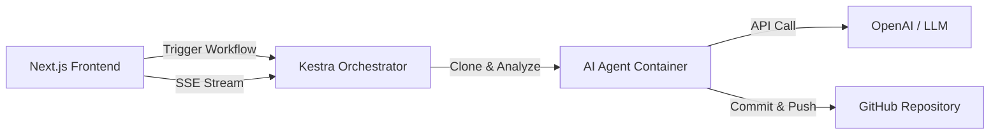

# 🤖 AutoFix AI - Automated GitHub Issue Resolution

[](https://nextjs.org/)
[](https://kestra.io/)
[](LICENSE)

**AutoFix AI** is an intelligent, automated platform that fixes GitHub issues using AI. Select an issue, let our AI agents analyze the codebase, generate a fix, and automatically create a Pull Request for you—all in minutes!


## ✨ **Key Features**

- 🔐 **Secure GitHub Integration** - Authenticate safely via GitHub OAuth.
- 🤖 **AI-Powered Code Fixes** - Advanced agents analyze, debug, and patch code.
- 🐰 **CodeRabbit Integration** - Automated 3rd-party code review for every PR.
- 📊 **Real-time Live Logs** - Watch the AI think and work with a terminal-style interface.
- 🎯 **Visual Progress Tracking** - Animated 10-step progress bar from analysis to PR.
- 🔄 **Automated Pull Requests** - The workflow creates ready-to-merge PRs automatically.
- 🎨 **Modern Dark Mode UI** - A premium, hackathon-ready interface built with Tailwind CSS.
- ⚡ **Kestra Orchestration** - Resilient, scalable workflow management powered by Kestra.

## 🚀 **Quick Start Guide**

Follow these steps to get the project running locally in under 10 minutes.

### **Prerequisites**

- **Node.js 18+** & **npm**
- **Docker** & **Docker Compose** (must be running)
- **GitHub Account**
- **AI API Key** (OpenAI, OpenRouter, Cerebras, or Together AI)

---

### **1. Clone the Repository**

```bash
git clone https://github.com/JS-Aakash/AutoFix-AI.git
cd AutoFix-AI
```

---

### **2. Environment Configuration**

#### **Root `.env`**
Create a `.env` file in the root directory. The system **automatically detects** the provider based on your API key type:

```env
# Supported Providers (Auto-Detected):
# - OpenAI (sk-...) -> gpt-4o
# - OpenRouter (sk-or-...) -> gemini-2.0-flash
# - Cerebras (csk-...) -> llama3.1-8b
# - Together AI (together_...) -> llama-3.1-70b
OPENAI_API_KEY=your_api_key_here
```

#### **Frontend `.env.local`**
Create a `frontend/.env.local` file for the Next.js app:
```env
# GitHub OAuth (See Step 3)
GITHUB_CLIENT_ID=your_github_client_id
GITHUB_CLIENT_SECRET=your_github_client_secret

# NextAuth Configuration
NEXTAUTH_SECRET=any_random_string_xyz
NEXTAUTH_URL=http://localhost:3000

# Kestra Integration
KESTRA_URL=http://localhost:8080
KESTRA_EMAIL=admin@example.com
KESTRA_PASSWORD=password123

# AI Agent Configuration
OPENAI_API_KEY=your_openai_api_key_here
```

---

### **3. Setup GitHub OAuth**

1. Go to **[GitHub Developer Settings](https://github.com/settings/developers)**.
2. Click **"New OAuth App"**.
3. Fill in the following details:
   - **Application Name**: `AutoFix AI`
   - **Homepage URL**: `http://localhost:3000`
   - **Authorization Callback URL**: `http://localhost:3000/api/auth/callback/github`
4. Register application.
5. Copy the **Client ID** and generate a new **Client Secret**.
6. Paste them into your `frontend/.env.local` file.

---

### **4. Start Kestra Orchestrator**

Launch the Kestra server and database using Docker Compose:

```bash
docker-compose -f docker-compose.kestra.yml up -d
```

Wait ~30 seconds for the containers to initialize.

**Configure Kestra:**
1. Open [http://localhost:8080](http://localhost:8080).
2. Create an Admin account when prompted (use checking credentials from your `.env.local`).
3. Navigate to **Flows** -> **Create**.
4. Copy the entire content of `kestra/workflows/ai-issue-autofix.yml`.
5. Paste it into the editor and click **Save**.

---

### **5. Run the Frontend**

Naviage to the frontend directory and start the dev server:

```bash
cd frontend
npm install
npm run dev
```

---

### **6. 🎉 Access the Application**

Open **[http://localhost:3000](http://localhost:3000)** in your browser.

**How to Use:**
1. **Sign In** with your GitHub account.
2. **Select a Repository** from the left panel.
3. **Select an Issue** from the right panel.
4. Click the **"Auto-Fix Issue with AI"** button.
5. Watch the **Live Logs** and **Progress Bar** as the AI clones, fixes, and pushes code!

---

### **7. 🐰 Enable CodeRabbit Reviews (Hackathon Partner)**

To get automated AI reviews on every PR:

1. Go to **[CodeRabbit.ai](https://coderabbit.ai/)** and sign up.
2. Install the **CodeRabbit GitHub App** on your repository.
3. That's it! The AutoFix agent automatically adds `@coderabbitai review` to every PR it creates, ensuring you get an instant high-quality code review.

---

## 🏗️ **Architecture Overview**



- **Frontend**: Next.js 16 app acting as the control plane.
- **Proxy Layer**: Next.js API Routes (`/api/kestra-proxy`) secure API keys.
- **Orchestrator**: Kestra manages the lifecycle (Container -> Script -> Notification).
- **Agent**: Node.js scripts (`src/orchestrator.js`) that handle git operations and AI logic.

---

## 🔧 **Troubleshooting**

**Q: Logs are stuck at "Initializing..."?**
- Ensure Kestra is running (`docker-compose ps`).
- Check if you created the Flow in Kestra with the ID `ai-issue-autofix`.

**Q: "401 Unauthorized" in logs?**
- Verify `KESTRA_EMAIL` and `KESTRA_PASSWORD` in `frontend/.env.local` match your Kestra account.

**Q: "GitHub API Rate Limit"?**
- This generally shouldn't happen with OAuth, but ensure your token scopes are valid.

---

## 🧪 **Testing Locally (Without Kestra)**

You can run the AI agent directly via CLI to test fixes:

```bash
# From root directory
node src/orchestrator.js \
  --issue https://github.com/owner/repo/issues/1 \
  --repo https://github.com/owner/repo.git \
  --dry-run
```

---

## ☁️ **Cloud Deployment**

Want to deploy this to production? We've got you covered:

- **🚂 [Railway Deployment](DEPLOY_RAILWAY.md)** - Easiest option, one-click deploy
- **🔷 [Vercel Frontend](DEPLOY_TO_VERCEL.md)** - Deploy the Next.js frontend
- **🌐 [Full Backend Deployment](DEPLOY_BACKEND.md)** - AWS, DigitalOcean, Render options

---

## 🤝 **Contributing**

Contributions, issues, and feature requests are welcome!
Feel free to check the [issues page](https://github.com/JS-Aakash/AutoFix-AI/issues).

## 📄 **License**

This project is licensed under the MIT License - see the [LICENSE](LICENSE) file for details.
