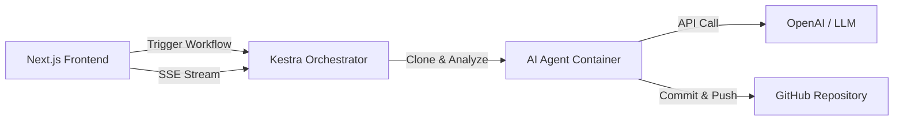

<div align="center">


# 🤖 Git-it-done — AI Agent  
### Automated GitHub Issue Resolution with AI

[](https://nextjs.org/)
[](https://kestra.io/)
[](https://coderabbit.ai/)
[](LICENSE)

</div>

---

## 🎯 Problem Statement

### The Operational Reality of Issue Resolution

GitHub issues remain unresolved not because they are inherently difficult, but because the workflow required to close them—from analysis through testing to pull request preparation—imposes **cumulative operational overhead**.

Resolving a typical issue requires:
- **Codebase Familiarization**: Understanding project structure, architectural patterns, and existing conventions  
- **Contextual Code Location**: Identifying which files and functions are affected by the issue  
- **Implementation & Iteration**: Writing, testing, and refining the solution across multiple cycles  
- **Test Coverage**: Creating or modifying test cases to validate the fix  
- **Pre-Merge Validation**: Running linters, type checkers, and test suites to prevent regressions  
- **PR Preparation**: Structuring commits, writing descriptions, and ensuring CI/CD passes  

This sequence is **deterministic and repeatable** across repositories.

### Current System Limitations

Existing AI-assisted tools address parts of this workflow:

| Capability | Limitation |
|-----------|-----------|
| **Code Suggestions** | Requires developer context-switching and manual integration |
| **Code Explanation** | Provides information without advancing the resolution |
| **Snippet Generation** | Lacks repository-level context and test validation |
| **Draft PRs** | Often require significant revision before merge-readiness |

The developer's role remains **full-cycle coordination**—the AI provides materials, but humans must execute assembly and validation.

### What's Missing

There is no **end-to-end autonomous system** that accepts a GitHub issue and consistently delivers:
1. A functioning implementation  
2. Updated or new test coverage  
3. Passing CI/CD checks  
4. A PR ready for maintainer review  

This gap leaves developers to perform low-value assembly work that could be systematized.

---

## 🚀 Project Pitch

**Git-it-done** is an autonomous software engineering agent that completes the full issue-resolution workflow.

It is not a code completion tool.  
It does not stop at suggestions.  
It executes end-to-end task completion.

### The Execution Model

Given a GitHub issue, Git-it-done:

1. **Reads and Interprets** the issue requirements and context  
2. **Analyzes the Repository** to understand codebase patterns and dependencies  
3. **Implements Solutions** following detected code conventions  
4. **Generates Test Cases** aligned with existing test patterns  
5. **Validates Changes** through automated testing and linting  
6. **Opens a PR** with structured commits and technical descriptions  

The developer's responsibility is reduced to **review and merge**.

### Design Philosophy

This system addresses **operational friction**, not developer capability.

Engineers are capable; the workflow is expensive. By automating the deterministic, repetitive steps of issue resolution, this agent:
- Reduces time-to-close for maintainers  
- Lowers the activation energy for contributors  
- Converts backlog stagnation into forward momentum  
- Preserves human judgment for review and architectural decisions  

### Differentiation Points

| Aspect | What Makes This Different |
|--------|--------------------------|
| **Scope** | Completes tasks end-to-end, not assisting with them. A PR is the output, not a starting point. |
| **Validation** | Test execution is built-in, not optional. No PR is created without passing local test suites. |
| **Observability** | Every step is logged and traceable. The developer can see **why** and **how** decisions were made. |
| **Production-Ready** | Built on established tools (GitHub, Docker, Kestra, CodeRabbit)—not prototyped or simulated. |
| **Determinism** | Workflows are reproducible. The same issue on the same codebase produces consistent results. |

### The Value Proposition

**Current State**: AI helps you write code.  
**This System**: AI helps you **finish work**.

If an issue can be clearly defined in a GitHub issue,  
this agent should be able to close it autonomously.

---

> _From issue to PR. No hand-holding. Just Git it done._


## ✨ **Key Features**

- 🔐 **Secure GitHub Integration** - Authenticate safely via GitHub OAuth.
- 🤖 **AI-Powered Code Fixes** - Advanced agents analyze, debug, and patch code.
- 🐰 **CodeRabbit Integration** - Automated 3rd-party code review for every PR.
- 📊 **Real-time Live Logs** - Watch the AI think and work with a terminal-style interface.
- 🎯 **Visual Progress Tracking** - Animated 10-step progress bar from analysis to PR.
- 🔄 **Automated Pull Requests** - The workflow creates ready-to-merge PRs automatically.
- 🎨 **Modern Dark Mode UI** - A premium, hackathon-ready interface built with Tailwind CSS.
- ⚡ **Kestra Orchestration** - Resilient, scalable workflow management powered by Kestra.

---

## 🐰 **CodeRabbit Integration**

**Git-it-done** is natively integrated with **CodeRabbit**, an AI-powered code review platform that provides instant, high-quality PR reviews.

### Why CodeRabbit?

Every PR created by Git-it-done automatically receives:
- **Instant AI Reviews** - Detailed analysis of code changes, potential bugs, and improvements
- **Security Scanning** - Detection of common vulnerabilities and security best practices
- **Performance Insights** - Identification of optimization opportunities
- **Code Quality Checks** - Style consistency, maintainability, and architectural alignment
- **Documentation Validation** - Verification that changes are properly documented

### Setup CodeRabbit (30 seconds)

1. Visit **[CodeRabbit.ai](https://coderabbit.ai/)** and sign up (free tier available).
2. Install the **CodeRabbit GitHub App** on your repository.
3. **Done!** Git-it-done automatically adds `@coderabbitai review` to every PR it creates.

No additional configuration needed. CodeRabbit reviews are generated before your team sees the PR.

## 🚀 **Quick Start Guide**

Follow these steps to get the project running locally in under 10 minutes.

### **Prerequisites**

- **Node.js 18+** & **npm**
- **Docker** & **Docker Compose** (must be running)
- **GitHub Account**
- **AI API Key** (OpenAI, OpenRouter, Cerebras, or Together AI)

---

### **1. Clone the Repository**

```bash
git clone https://github.com/JS-Aakash/AutoFix-AI.git
cd AutoFix-AI
```

---

### **2. Environment Configuration**

#### **Root `.env`**
Create a `.env` file in the root directory. The system **automatically detects** the provider based on your API key type:

```env
# Supported Providers (Auto-Detected):
# - OpenAI (sk-...) -> gpt-4o
# - OpenRouter (sk-or-...) -> gemini-2.0-flash
# - Cerebras (csk-...) -> llama3.1-8b
# - Together AI (together_...) -> llama-3.1-70b
OPENAI_API_KEY=your_api_key_here
```

#### **Frontend `.env.local`**
Create a `frontend/.env.local` file for the Next.js app:
```env
# GitHub OAuth (See Step 3)
GITHUB_CLIENT_ID=your_github_client_id
GITHUB_CLIENT_SECRET=your_github_client_secret

# NextAuth Configuration
NEXTAUTH_SECRET=any_random_string_xyz
NEXTAUTH_URL=http://localhost:3000

# Kestra Integration
KESTRA_URL=http://localhost:8080
KESTRA_EMAIL=admin@example.com
KESTRA_PASSWORD=password123

# AI Agent Configuration
OPENAI_API_KEY=your_openai_api_key_here
```

---

### **3. Setup GitHub OAuth**

1. Go to **[GitHub Developer Settings](https://github.com/settings/developers)**.
2. Click **"New OAuth App"**.
3. Fill in the following details:
   - **Application Name**: `AutoFix AI`
   - **Homepage URL**: `http://localhost:3000`
   - **Authorization Callback URL**: `http://localhost:3000/api/auth/callback/github`
4. Register application.
5. Copy the **Client ID** and generate a new **Client Secret**.
6. Paste them into your `frontend/.env.local` file.

---

### **4. Start Kestra Orchestrator**

Launch the Kestra server and database using Docker Compose:

```bash
docker-compose -f docker-compose.kestra.yml up -d
```

Wait ~30 seconds for the containers to initialize.

**Configure Kestra:**
1. Open [http://localhost:8080](http://localhost:8080).
2. Create an Admin account when prompted (use checking credentials from your `.env.local`).
3. Navigate to **Flows** -> **Create**.
4. Copy the entire content of `kestra/workflows/ai-issue-autofix.yml`.
5. Paste it into the editor and click **Save**.

---

### **5. Run the Frontend**

Naviage to the frontend directory and start the dev server:

```bash
cd frontend
npm install
npm run dev
```

---

### **6. 🎉 Access the Application**

Open **[http://localhost:3000](http://localhost:3000)** in your browser.

**How to Use:**
1. **Sign In** with your GitHub account.
2. **Select a Repository** from the left panel.
3. **Select an Issue** from the right panel.
4. Click the **"Auto-Fix Issue with AI"** button.
5. Watch the **Live Logs** and **Progress Bar** as the AI clones, fixes, and pushes code!

---

### **7. 🐰 Enable CodeRabbit Reviews (Hackathon Partner)**

To get automated AI reviews on every PR:

1. Go to **[CodeRabbit.ai](https://coderabbit.ai/)** and sign up.
2. Install the **CodeRabbit GitHub App** on your repository.
3. That's it! The AutoFix agent automatically adds `@coderabbitai review` to every PR it creates, ensuring you get an instant high-quality code review.

---

## 🏗️ **Architecture Overview**



- **Frontend**: Next.js 16 app acting as the control plane.
- **Proxy Layer**: Next.js API Routes (`/api/kestra-proxy`) secure API keys.
- **Orchestrator**: Kestra manages the lifecycle (Container -> Script -> Notification).
- **Agent**: Node.js scripts (`src/orchestrator.js`) that handle git operations and AI logic.

---

## 🔧 **Troubleshooting**

**Q: Logs are stuck at "Initializing..."?**
- Ensure Kestra is running (`docker-compose ps`).
- Check if you created the Flow in Kestra with the ID `ai-issue-autofix`.

**Q: "401 Unauthorized" in logs?**
- Verify `KESTRA_EMAIL` and `KESTRA_PASSWORD` in `frontend/.env.local` match your Kestra account.

**Q: "GitHub API Rate Limit"?**
- This generally shouldn't happen with OAuth, but ensure your token scopes are valid.

---

## 🧪 **Testing Locally (Without Kestra)**

You can run the AI agent directly via CLI to test fixes:

```bash
# From root directory
node src/orchestrator.js \
  --issue https://github.com/owner/repo/issues/1 \
  --repo https://github.com/owner/repo.git \
  --dry-run
```

---

## 🤝 **Contributing**

Contributions, issues, and feature requests are welcome!
Feel free to check the [issues page](https://github.com/JS-Aakash/AutoFix-AI/issues).

## 📄 **License**

This project is licensed under the MIT License - see the [LICENSE](LICENSE) file for details.
